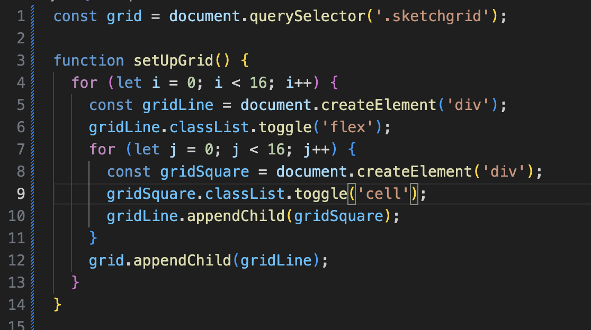

# etch-a-sketch

## About

This is my attempt at the etch a sketch project from The Odin Project. This is one of the last projects in the foundations section and is meant to sharpen my DOM manipulation skills as well as exercise my ability to google things to fill gaps in my knowledge to get my code to do what I want it to.

## Challenges/Things I Learned

1. I created my grid using flexbox without googling. My approach was to create a flex container for the grid, make each flex item act as a row and inside each row to create the individual cells that make up the grid. This is what I originally wrote:

I wondered if there was a way to do it without the nested for loops, but what I found on google was pretty much similar to what I wrote. The difference was that in my CSS, i hard coded the height and width of the cells. But what about later on in the project when the user wants to select a different amount of cells for each row?

The problem was that if the user is going to be able to choose how many cells are in each row, then the width for each cell needs to be dynamic. The solution was to make each cell have a flex basis of 100% so each cell takes up equal space in the row. Then, to get the height to dynamically change so the cells stay square, I used the aspect-ratio property for the cell and set it to 1/1.

Sources:
[making a grid with flex](https://www.taniarascia.com/easiest-flex-grid-ever/)
[keeping the grid cells square](https://stackoverflow.com/questions/2648733/make-a-div-square-when-there-is-a-dynamically-changing-width-based-on-percenta)
